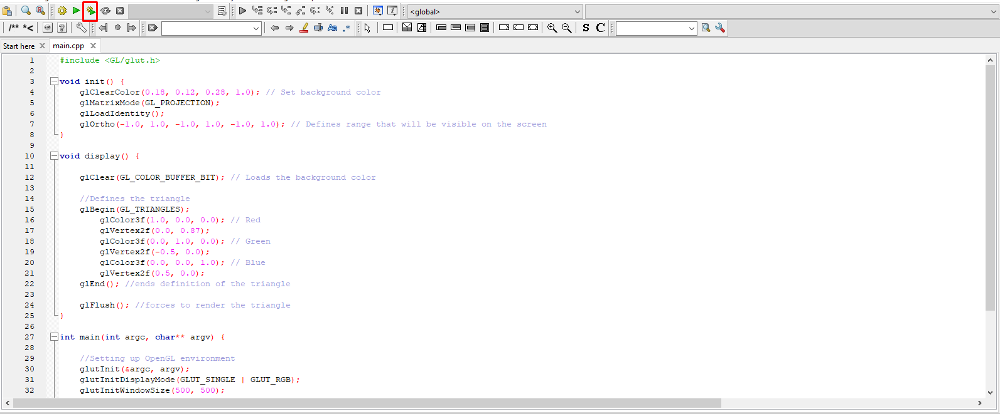

# Implementación en ThreeJS

**Nombre:** Néstor Herrera
**Carnet:** 18-10796
**API:** OpenGL
**SO:** Windows 10 64 bits

Dependencias a instalar:
- MinGW
- Freeglut (herramientas necesarias para manejar OpenGL)
- Glew (carga extensiones de OpenGL durante la ejecucion)

Para información sobre la instalación de las dependencias ver:
https://medium.com/swlh/setting-opengl-for-windows-d0b45062caf
(en Windows esta fumado.)

No logre correrlo directamente desde la consola (piedad, no me dio tiempo para resolver T_T), por lo que se requiere la instalacion
y configuracion de Code::Blocks segun las instrucciones del sitio.

## Cómo correrlo

Abrir en Code::Blocks el archivo main.cpp

